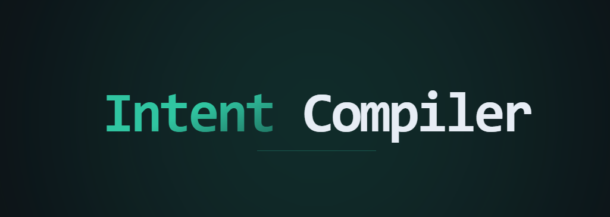

# Intent Compiler

> **Stop writing prompts. Compile intent into AI systems.**

<p align="center">
  
</p>

Intent Compiler is a reactive workflow system that transforms high-level user goals into structured, executable execution plans. It bridges the gap between vague natural language and precise technical instructions, generating everything from step-by-step workflows to industry-standard instruction files like `CLAUDE.md`, `.cursorrules`, and `AGENTS.md`.

## Overview

Complex technical tasks often fail due to poorly defined context, shifting requirements, and generic prompts. Intent Compiler solves this by:
1. **Identifying Intent:** Capturing the core objective of the user.
2. **Refining Context:** Using LLMs to intelligently suggest project types, target audiences, and technical constraints.
3. **Compiling Behavior:** Transforming the refined intent into a structured set of actionable steps or specialized instruction files.

## Features

- **Smart Suggestions:** LLM-powered field recommendations (Project, Audience, Style, Tone) tailored to your specific intent.
- **Reactive Workflows:** A dynamic execution interface where steps can be run, refined, or modified individually.
- **Instruction Generator:** Exports intents into 6+ specialized formats including `CLAUDE.md`, `AGENTS.md`, `.cursorrules`, and `.windsurfrules`.
- **Multi-Agent Orchestration:** Coordinates specialized AI agents for complex system building with role matching and skill registry.
- **Intelligent Model Orchestration:** A 3-tier model strategy (Quality, Efficiency, Speed) that automatically selects the best LLM for each sub-task.
- **Dynamic Provider Support:** Real-time fetching and selection of models from OpenRouter, Groq, OpenAI, and Ollama.
- **Local LLM Support (Ollama):** High-speed, private inference using models running on your local machine.
- **Project Scan Engine:** Automatically detects your project's name and tech stack (Next.js, React, Tailwind, TS) to provide zero-click context.
- **Quality Scoring System:** 6-dimensional evaluation (correctness, specificity, executability, safety, compatibility, brevity) with validation gates.
- **Vibe Mode:** A dedicated high-fidelity UI view for ultra-fast architectural building with reusable templates.
- **Intelligent Questioning:** AI-driven clarification system that asks targeted questions to refine vague intent.
- **Step Validation:** Execution-time validation with rollback capabilities and error recovery.

## Architecture

Intent Compiler is built with a **Fullstack Next.js (App Router)** architecture, emphasizing low latency and high-fidelity UI.

*   **Frontend (React/Framer Motion):** A glassmorphic, reactive interface managed by a central `ContextForm` and `WorkflowContainer`. It uses `framer-motion` for high-end micro-animations and `z-index` layering for perfect UI stacking.
*   **Model Orchestration Layer (`lib/aicc`):** A custom internal abstraction (`AICC`) that manages multi-provider authentication, model property extraction (context length, capabilities), and dynamic tier-based selection.
*   **Compiler Logic (`lib/contextCompiler`):** Implements the logic for building refined prompts, grading result quality, and formatting structured outputs.
*   **API Layer (`app/api`):** Serverless endpoints for real-time suggestion fetching, workflow compilation, and model list synchronization.

## Tech Stack

- **Framework:** [Next.js 15](https://nextjs.org/) (App Router)
- **UI:** [React 19](https://reactjs.org/), [Tailwind CSS](https://tailwindcss.com/)
- **Animations:** [Framer Motion](https://www.framer.com/motion/)
- **AI Integration:** [OpenAI SDK](https://github.com/openai/openai-node), [OpenRouter](https://openrouter.ai/), [Groq API](https://groq.com/)
- **Validation:** [Zod](https://zod.dev/) (schema validation), [AJV](https://ajv.js.org/) (JSON validation)
- **Database:** [SQLite](https://www.sqlite.org/) (better-sqlite3 for local storage)
- **Export:** [jsPDF](https://github.com/parallax/jsPDF) (PDF generation), [JSZip](https://stuk.github.io/jszip/) (bundle exports)
- **Markdown:** [react-markdown](https://github.com/remarkjs/react-markdown), [remark-gfm](https://github.com/remarkjs/remark-gfm)
- **Language:** TypeScript 5.8
- **Linting:** ESLint

## Repository Structure

```text
/app
  /api                    → Serverless API endpoints
    /analysis             → Project and repo analysis endpoints
    /compilation          → Intent compilation and workflow generation
    /execution            → Step execution and validation
    /generation           → Instruction file generation (CLAUDE.md, etc.)
    /model-selection      → Model routing and recommendations
    /suggestions          → LLM-powered field suggestions
    /validation           → Quality scoring and validation gates
  /workflow               → Interactive workflow execution page
/components
  /ui                     → Reusable glassmorphic components
  ContextForm.tsx         → Main intent entry & context refinement engine
  ExecutionPanel.tsx      → Step execution interface
  FileTree.tsx            → Project structure visualization
  HistoryPanel.tsx        → Workflow history and versioning
  InputForm.tsx           → Structured input collection
  IntelligentQuestionsModal.tsx → AI-driven clarification UI
  ModelRecommendationBadge.tsx    → Model selection indicators
  RepoInput.tsx           → Repository URL input with analysis
  StepCard.tsx            → Individual workflow step component
  TierBadge.tsx           → Quality/Efficiency/Speed tier indicator
  VibeLibrary.tsx         → Template browser and selector
  WelcomeIntro.tsx        → Onboarding and example carousel
  WorkflowContainer.tsx   → Step-by-step execution orchestrator
/lib
  /core                   → Core utilities (JSON guard, OpenAI, storage)
  aicc.ts                 → AI Control Center - multi-provider abstraction
  agentOrchestrator.ts    → Multi-agent coordination and dispatch
  contextCompiler.ts    → Structured prompt building & compilation
  contextEngineer.ts     → Advanced context refinement pipeline
  db.ts                   → SQLite database interface
  dynamicRoles.ts         → Role definition and matching system
  executionEngine.ts      → Workflow execution with rollback support
  fileExporter.ts         → ZIP, PDF export functionality
  instructionAssembler.ts → Multi-format instruction file builder
  instructionQuality.ts   → Quality scoring for generated instructions
  intelligentQuestioner.ts → AI-driven intent clarification
  jsonGuard.ts            → Robust JSON parsing with fallbacks
  knowledgeBase.ts        → Domain knowledge and best practices
  logger.ts               → Structured logging system
  modelRouter.ts          → Intelligent model selection by task type
  phaseWorkflow.ts        → Phased workflow state management
  projectAnalyzer.ts      → Automatic project structure detection
  repoAnalyzer.ts         → GitHub repository analysis
  roleDatabase.ts         → Agent role definitions and skills
  roleMatcher.ts          → Intelligent agent-role matching
  schemas.ts              → Zod validation schemas
  skillsRegistry.ts       → Agent capabilities registry
  stepQuality.ts          → Step-level quality validation
  superIntelligentModel.ts → Advanced model orchestration
  tierConfig.ts           → Tier-based model configuration
  types.ts                → TypeScript type definitions
  validationCheckpoint.ts → Execution validation gates
  vibeStorage.ts          → Vibe template persistence
```

## Installation

### Prerequisites
- Node.js 18.x or higher
- npm or yarn

### Setup
1. Clone the repository:
   ```bash
   git clone https://github.com/PantheraLabs/IntentCompiler.git
   cd IntentCompiler
   ```
2. Install dependencies:
   ```bash
   npm install
   ```
3. Configure environment variables. Create a `.env` file in the root:
   ```env
   OPENAI_API_KEY=your_openai_key
   OPENROUTER_API_KEY=your_openrouter_key
   GROQ_API_KEY=your_groq_key
   ```
   *(See `.env.example` for all required fields)*

## Usage

### 1. Identify your Intent
Enter a high-level goal in the home screen. Use the **Example Carousel** for inspiration.

### 2. Refine Context
The system will automatically suggest a project type, audience, and constraints. You can use the **Smart Suggestion Chips** to quickly fill out the form.

### 3. Select your Tier
The system automatically optimizes for **Speed** (suggestions), **Efficiency** (refinement), or **Quality** (final compilation). You can manually override models in the dropdowns.

### 4. Compile & Execute
- **Compile Workflow:** Generates a structured execution plan you can run step-by-step.
- **Compile Instruction File:** Generates a high-quality `CLAUDE.md` or `.cursorrules` file based on your intent.

## Development

Run the development server locally:
```bash
npm run dev
```

The application will be available at `http://localhost:3000`.

### Linting & Formatting
```bash
npm run lint
```

## Roadmap

- [x] Support for local LLM providers (Ollama).
- [x] Integrate project context auto-detection/scanning.
- [ ] Export workflows directly to JSON/YAML for CLI runners.
- [ ] Multi-turn intent refinement (chat-based context building).
- [ ] Performance benchmarking for different model tiers.

## License

Copyright (c) 2026 Rishi Praseeth Krishnan. All rights reserved.

This software and its source code are for viewing and reference only. No license is granted to use, copy, modify, distribute, or create derivative works without express written permission. See the [LICENSE](file:///c:/Users/rishi/Documents/GitHub/IntentCompiler/LICENSE) file for the full restrictive terms.
